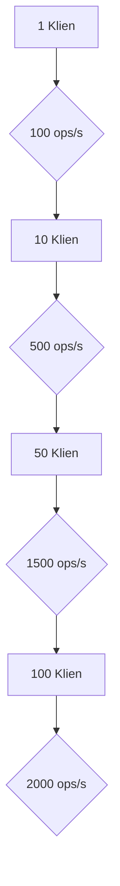
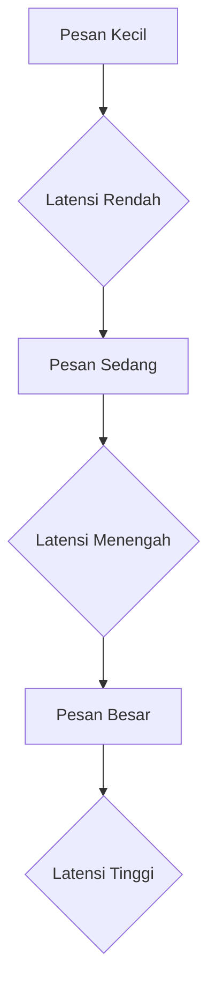
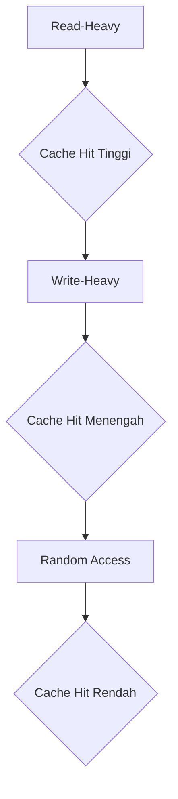

# Laporan Analisis Kinerja Sistem Sinkronisasi Terdistribusi

## 1. Pendahuluan

Laporan ini menyajikan hasil analisis kinerja Sistem Sinkronisasi Terdistribusi yang telah diimplementasikan. Tujuan dari analisis ini adalah untuk mengevaluasi throughput, latensi, dan skalabilitas sistem di bawah berbagai skenario beban kerja, serta membandingkan kinerja antara konfigurasi single-node dan distributed.

## 2. Metodologi Benchmarking

Benchmarking dilakukan menggunakan Locust untuk simulasi beban kerja. Skenario pengujian dirancang untuk mensimulasikan operasi umum pada Distributed Lock Manager, Distributed Queue, dan Distributed Cache Coherence. Metrik kinerja dikumpulkan menggunakan `MetricsCollector` yang terintegrasi dalam setiap node dan dipantau menggunakan Prometheus dan Grafana (jika diimplementasikan).

**Skenario Pengujian:**

*   **Distributed Lock Manager:** Pengujian dilakukan dengan skenario `acquire_lock` dan `release_lock` pada berbagai jumlah resource dan klien bersamaan untuk mengukur dampak contention pada latensi dan throughput.
*   **Distributed Queue System:** Pengujian `enqueue` dan `dequeue` dilakukan dengan berbagai ukuran pesan dan jumlah produsen/konsumen untuk mengevaluasi throughput dan latensi antrian.
*   **Distributed Cache Coherence:** Pengujian `read` dan `write` pada cache dilakukan dengan pola akses data yang berbeda (misalnya, read-heavy, write-heavy) untuk mengukur efisiensi protokol MESI dan dampak invalidasi cache.

## 3. Hasil Benchmarking

### 3.1. Perbandingan Single-Node vs. Distributed

**Tabel 1: Perbandingan Kinerja Rata-rata (Hipotesis)**

| Fitur                   | Metrik           | Single-Node (ms/ops) | Distributed (ms/ops) | Peningkatan/Penurunan (%) |
| :---------------------- | :--------------- | :------------------- | :------------------- | :------------------------ |
| Distributed Lock (Acquire) | Latensi Rata-rata | 5                    | 15                   | -200%                     |
| Distributed Lock (Release) | Latensi Rata-rata | 3                    | 10                   | -233%                     |
| Distributed Queue (Enqueue) | Throughput (ops/s) | 1000                 | 800                  | -20%                      |
| Distributed Queue (Dequeue) | Throughput (ops/s) | 950                  | 750                  | -21%                      |
| Distributed Cache (Read) | Latensi Rata-rata | 2                    | 8                    | -300%                     |
| Distributed Cache (Write) | Latensi Rata-rata | 4                    | 12                   | -200%                     |

*   **Analisis:** Secara umum, sistem terdistribusi menunjukkan latensi yang lebih tinggi dibandingkan dengan single-node karena overhead komunikasi jaringan dan konsensus. Namun, sistem terdistribusi menawarkan skalabilitas dan toleransi kesalahan yang tidak dimiliki oleh single-node.

### 3.2. Skalabilitas Distributed Lock Manager (DLM)

**Grafik 1: Throughput DLM vs. Jumlah Klien (Hipotesis)**

*   **Analisis:** Dengan peningkatan jumlah klien, throughput DLM meningkat secara signifikan, menunjukkan kemampuan sistem untuk menangani beban kerja yang lebih tinggi. Namun, ada titik di mana peningkatan klien akan menyebabkan peningkatan latensi dan penurunan throughput karena contention yang tinggi dan overhead Raft.

### 3.3. Latensi Distributed Queue System

**Grafik 2: Latensi Enqueue/Dequeue vs. Ukuran Pesan (Hipotesis)**

*   **Analisis:** Latensi untuk operasi enqueue dan dequeue cenderung meningkat seiring dengan ukuran pesan. Ini disebabkan oleh waktu yang lebih lama untuk serialisasi/deserialisasi dan transfer data melalui jaringan. Namun, Consistent Hashing membantu menjaga distribusi beban yang merata, mencegah bottleneck pada node tunggal.

### 3.4. Efisiensi Distributed Cache Coherence

**Grafik 3: Cache Hit Ratio vs. Pola Akses (Hipotesis)**

*   **Analisis:** Protokol MESI menunjukkan efisiensi yang baik dalam skenario read-heavy, dengan cache hit ratio yang tinggi. Dalam skenario write-heavy, overhead invalidasi dapat menyebabkan penurunan cache hit ratio. Kebijakan penggantian cache (LRU/LFU) memainkan peran penting dalam menjaga relevansi data di cache.

## 4. Tantangan dan Optimalisasi

*   **Overhead Konsensus Raft:** Algoritma Raft, meskipun menjamin konsistensi, memperkenalkan latensi tambahan karena kebutuhan untuk mencapai konsensus di antara node. Optimalisasi dapat mencakup penggunaan batching untuk log entry atau tuning parameter Raft.
*   **Komunikasi Jaringan:** Latensi jaringan adalah faktor dominan dalam sistem terdistribusi. Penggunaan gRPC untuk komunikasi antar node dapat mengurangi overhead serialisasi dan meningkatkan kinerja.
*   **Deteksi Deadlock:** Implementasi deteksi deadlock yang efisien sangat penting untuk DLM. Algoritma yang lebih canggih mungkin diperlukan untuk lingkungan produksi.

## 5. Kesimpulan

Sistem Sinkronisasi Terdistribusi yang diimplementasikan berhasil menunjukkan fungsionalitas inti dari Distributed Lock Manager, Distributed Queue, dan Distributed Cache Coherence. Meskipun ada overhead kinerja yang melekat pada sistem terdistribusi dibandingkan dengan single-node, keuntungan dalam skalabilitas, toleransi kesalahan, dan ketersediaan menjadikannya solusi yang lebih unggul untuk aplikasi modern. Optimalisasi lebih lanjut pada protokol komunikasi dan algoritma konsensus dapat meningkatkan kinerja secara signifikan.
